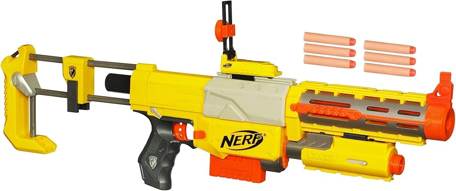

This is the first major project that I have attempted, my goal is to create a function motion controller inside a nerf blaster, with enough motion controls, buttons and joysticks to function like a standard controller.            

For this first post I will be planning some aspects of the project before starting.

### Why I'm doing this project

### Choosing a blaster

I wanted to choose a nerf blaster that both looks good and has room for all of the functions I want, this is why I have chosen to use a Nerf CS-6 Recon. This blaster has many benefits, for example if I put the motion controller in the main partof the blaster, I will be able to remove the stock and barrel and use the pistol form of the blaster as a controller for a point and shoot game.

### Positioning the buttons

To have the same function as a standard controller, I will need the equivalent of: 2 joysticks, 2 triggers, 2 bumpers, 4 buttons, 1 D-pad and a start button. The motion controls: up, down, left and right will serve as the equivalent of one of the joysticks, meaning I will likely need to have the rest as physical buttons. I will add a joystick to the side of the blaster, which will act as a left joystick for movement, meaning the player can easily move a character and look around by using the joystick alongside the motion controls.

The equivalent of the x button, commonly used for reloading, will be pulling back the priming handle, and the other three will be placed on the opposite side as the joystick, so that the user can hold the joystick with a thumb and press the buttons with their fingers.

The right trigger which is usually used for shooting will obviously be the trigger, and I will add a small button in the grip below the trigger to act as the left trigger for zooming.

This leaves only the start button and bumpers, I will need to decide later on where these go once I can properly judge the ergonomics of the blaster. Now that I have decided where to put all of the buttons, I can prepare the blaster and add any modifications necessary.

### Stay Tuned

In the next post I will be dissassembling the blaster and preparing it, then its on to the electronics. 🎉